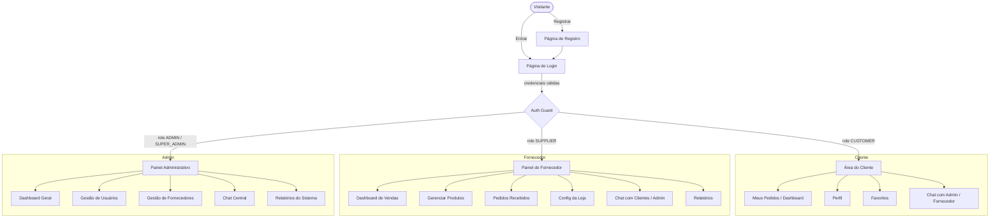
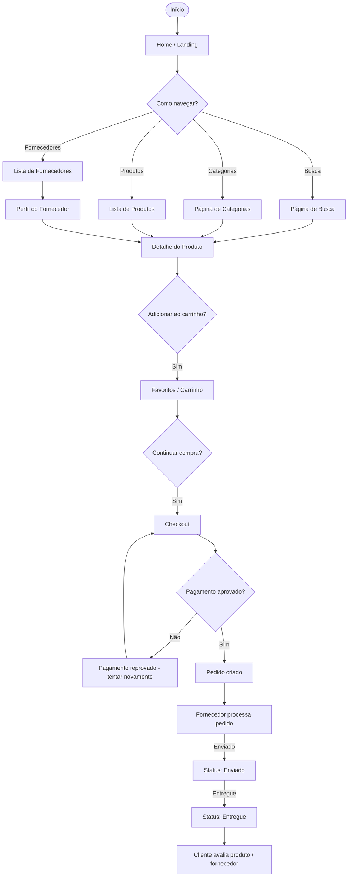
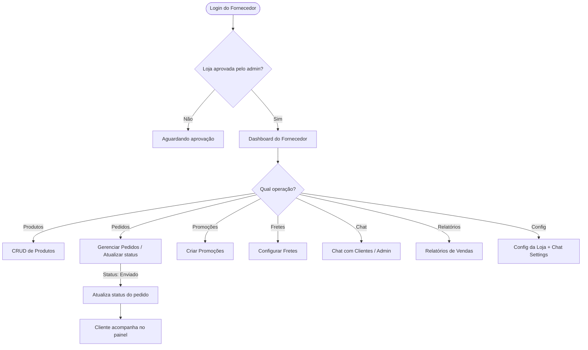
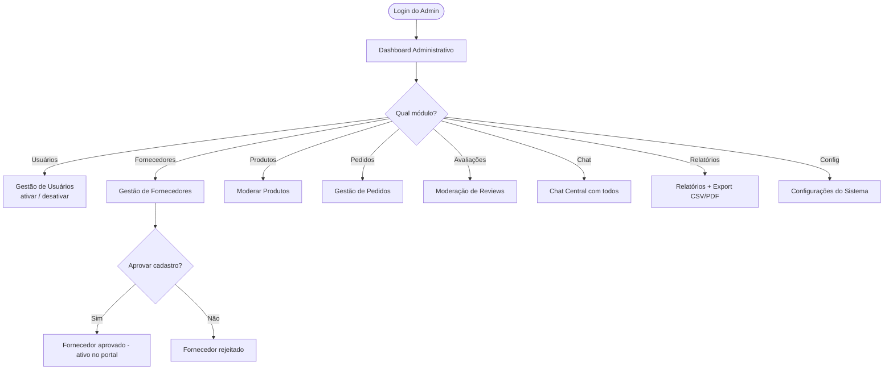
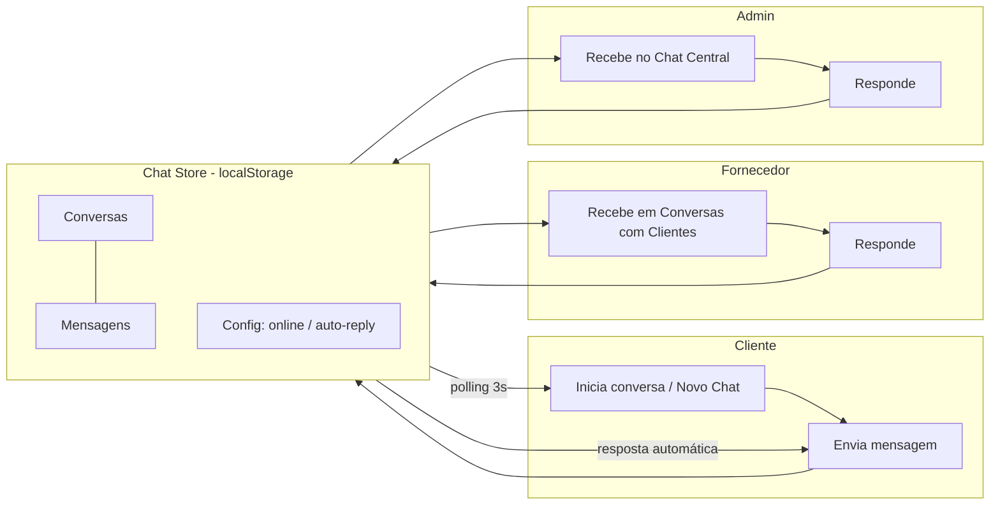
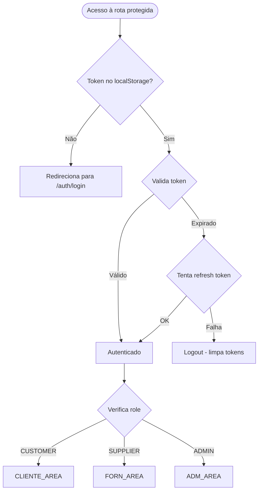
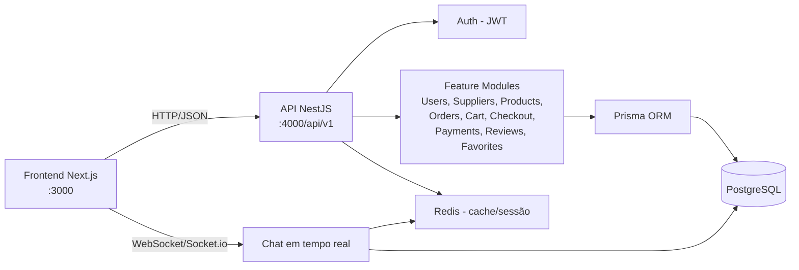

# Fluxograma do Sistema — AgroBuscaFácil

> Renderiza em qualquer visualizador Mermaid (GitHub, VS Code, mermaid.live). Para gerar PNG/SVG: `npx @mermaid-js/mermaid-cli -i fluxograma.md -o fluxograma.png`.

## 1. Visão geral dos atores

## 2. Fluxo de compra do cliente

## 3. Fluxo do fornecedor

## 4. Fluxo do administrador

## 5. Fluxo do chat (tempo real)

## 6. Fluxo de autenticação

## 7. Fluxo de dados geral (arquitetura)

